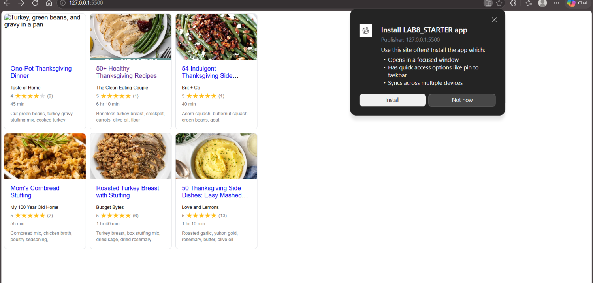

# Lab8-Starter

Nishant Sharma - Team 24  

https://sharmanishant11.github.io/Lab8_Starter/index.html  

Graceful degradation and service workers are related because both help improve the user experience when network conditions or browser support are limited.  
Graceful degradation ensures that a website still functions even if some advanced features are unavailable.  
Service workers help by caching resources and allowing parts of the website to continue working offline or during poor internet connectivity.  
  
